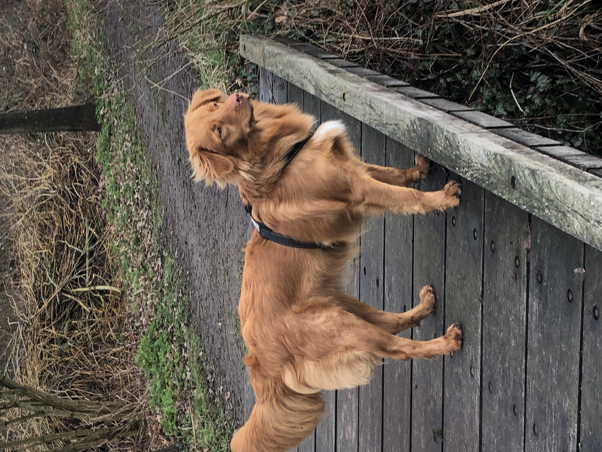

```{r, setup}

library(tidyverse)
library(plotly)
library(spotifyr)
library(compmus)
```

```{r,}
circshift <- function(v, n) {
  if (n == 0) v else c(tail(v, n), head(v, -n))
}

#      C     C#    D     Eb    E     F     F#    G     Ab    A     Bb    B
major_chord <-
  c(   1,    0,    0,    0,    1,    0,    0,    1,    0,    0,    0,    0)
minor_chord <-
  c(   1,    0,    0,    1,    0,    0,    0,    1,    0,    0,    0,    0)
seventh_chord <-
  c(   1,    0,    0,    0,    1,    0,    0,    1,    0,    0,    1,    0)

major_key <-
  c(6.35, 2.23, 3.48, 2.33, 4.38, 4.09, 2.52, 5.19, 2.39, 3.66, 2.29, 2.88)
minor_key <-
  c(6.33, 2.68, 3.52, 5.38, 2.60, 3.53, 2.54, 4.75, 3.98, 2.69, 3.34, 3.17)

chord_templates <-
  tribble(
    ~name, ~template,
    "Gb:7", circshift(seventh_chord, 6),
    "Gb:maj", circshift(major_chord, 6),
    "Bb:min", circshift(minor_chord, 10),
    "Db:maj", circshift(major_chord, 1),
    "F:min", circshift(minor_chord, 5),
    "Ab:7", circshift(seventh_chord, 8),
    "Ab:maj", circshift(major_chord, 8),
    "C:min", circshift(minor_chord, 0),
    "Eb:7", circshift(seventh_chord, 3),
    "Eb:maj", circshift(major_chord, 3),
    "G:min", circshift(minor_chord, 7),
    "Bb:7", circshift(seventh_chord, 10),
    "Bb:maj", circshift(major_chord, 10),
    "D:min", circshift(minor_chord, 2),
    "F:7", circshift(seventh_chord, 5),
    "F:maj", circshift(major_chord, 5),
    "A:min", circshift(minor_chord, 9),
    "C:7", circshift(seventh_chord, 0),
    "C:maj", circshift(major_chord, 0),
    "E:min", circshift(minor_chord, 4),
    "G:7", circshift(seventh_chord, 7),
    "G:maj", circshift(major_chord, 7),
    "B:min", circshift(minor_chord, 11),
    "D:7", circshift(seventh_chord, 2),
    "D:maj", circshift(major_chord, 2),
    "F#:min", circshift(minor_chord, 6),
    "A:7", circshift(seventh_chord, 9),
    "A:maj", circshift(major_chord, 9),
    "C#:min", circshift(minor_chord, 1),
    "E:7", circshift(seventh_chord, 4),
    "E:maj", circshift(major_chord, 4),
    "G#:min", circshift(minor_chord, 8),
    "B:7", circshift(seventh_chord, 11),
    "B:maj", circshift(major_chord, 11),
    "D#:min", circshift(minor_chord, 3)
  )

key_templates <-
  tribble(
    ~name, ~template,
    "Gb:maj", circshift(major_key, 6),
    "Bb:min", circshift(minor_key, 10),
    "Db:maj", circshift(major_key, 1),
    "F:min", circshift(minor_key, 5),
    "Ab:maj", circshift(major_key, 8),
    "C:min", circshift(minor_key, 0),
    "Eb:maj", circshift(major_key, 3),
    "G:min", circshift(minor_key, 7),
    "Bb:maj", circshift(major_key, 10),
    "D:min", circshift(minor_key, 2),
    "F:maj", circshift(major_key, 5),
    "A:min", circshift(minor_key, 9),
    "C:maj", circshift(major_key, 0),
    "E:min", circshift(minor_key, 4),
    "G:maj", circshift(major_key, 7),
    "B:min", circshift(minor_key, 11),
    "D:maj", circshift(major_key, 2),
    "F#:min", circshift(minor_key, 6),
    "A:maj", circshift(major_key, 9),
    "C#:min", circshift(minor_key, 1),
    "E:maj", circshift(major_key, 4),
    "G#:min", circshift(minor_key, 8),
    "B:maj", circshift(major_key, 11),
    "D#:min", circshift(minor_key, 3)
  )
```

```{r, selecting data from spotify and combining for analysis}

dogs <- get_playlist_audio_features("", "5hQo2asoxqQrnJFeufycj1")
humans <- get_playlist_audio_features("", "3B0FtfxNiFOo82o8lmJcIp")
dogsscience <- get_playlist_audio_features("", "0km3mDUsP3LYDS1BZfqsY5")
humansscience <- get_playlist_audio_features("", "1t06IDDtn5eYo4Ow7Fwmcb")

combine4lists <-
bind_rows(
humans |> mutate(category = "Humans"),
dogs |> mutate(category = "Dogs"),
dogsscience |> mutate(category = "Dogsscience"),
humansscience |> mutate(category = "Humansscience")
)
```

### Homework for week 10

```{r, 1 single variable compared, homework week 10}
combine4lists |>
  ggplot(aes(x = category, y = key)) +
  geom_boxplot()
```

------------------------------------------------------------------------

A remarkable (in my opinion) similarity on keys between the groups, the mean in 3 out of 4 groups on key 5, which is F. Only "humansscience" has F# as mean. I find it very remarkable that the key of C (nr. 1), one would expect an often used key, is completely missing in these boxplots. Further to be analysed.

Analysis on chordograms to follow under the next tab \*\*\*

### Homework week 10 continued (Chordograms) {data-commentary-width="500"}

```{r, echo = FALSE}
strawberryswing <- get_tidy_audio_analysis("2dphvmoLEXdk8hOYxmHlI3") 
strawberryswing|>
  compmus_align(bars, segments) |>
  select(bars) |>
  unnest(bars) |>
  mutate(
    pitches =
      map(segments,
        compmus_summarise, pitches,
        method = "mean", norm = "manhattan"
      )
  ) |> 
  compmus_match_pitch_template(chord_templates, "euclidean", "manhattan") |>
  ggplot(
    aes(x = start + duration / 2, width = duration, y = name, fill = d)
  ) +
  geom_tile() +
  scale_fill_viridis_c(guide = "none") +
  theme_minimal() +
  labs(x = "Time (s)", y = "")
```

------------------------------------------------------------------------

As most songs from all 4 playlists are -intendedly- not very 'exciting' in terms of a lot of musical elements (and their possible changes during a song) like tempo, energy, instrumentalness, etc. I decided to pick an outlier from playlist 3 (humansscience) which scores highest on tempo and relatively high on energy: Strawberry Swing by Coldplay, to see what happens chords-wise. A chordagram is presented here.

The song is in Ab (as tonica I) with mostly changes to IV (Db) and V (Eb). This is a rather 'normal' chords progression. The black spot around 95 seconds in Db appears to me the emphasis/power on Db (as 'tension' dominant to Ab) just before 'releasing' to tonica Ab ('home'/stability). The same 'returned home' energy on Ab can been seen in the last 80 seconds of the song. As G# enharmonically is the same as Ab, it is no surprise that there's relative a lot of energy in there too. There's also a prominance to be seen in seventh chords, a usual patterns in chordagrams as explained by our lector: 'leakage' of energy in the 7th 'bin' (close to the 1st tonica) plays a role here sometimes).

------------------------------------------------------------------------

### Homework week 10 continued (part 3): chordogram on keys {data-commentary-width="500"}

```{r, strawberryswing continued} 
strawberryswing <- get_tidy_audio_analysis("2dphvmoLEXdk8hOYxmHlI3") |>
  compmus_align(sections, segments) |>
  select(sections) |>
  unnest(sections) |>
  mutate(
    pitches =
      map(segments,
        compmus_summarise, pitches,
        method = "mean", norm = "manhattan"
      )
  )
```
```{r, strawberry swing pitch outcomes}
strawberryswing |> 
  compmus_match_pitch_template(
    key_templates,         # Change to chord_templates if descired
    method = "euclidean",  # Try different distance metrics
    norm = "manhattan"     # Try different norms
  ) |>
  ggplot(
    aes(x = start + duration / 2, width = duration, y = name, fill = d)
  ) +
  geom_tile() +
  scale_fill_viridis_c(guide = "none") +
  theme_minimal() +
  labs(x = "Time (s)", y = "")
```
***

As expected, an emphasis on I, IV and V prominence for a song in Ab. Interesting:a lot of dark blue in C# (enharmonically the same as Db). With knowledge of Western chords and their relationships (tonica, subdominant, dominant and others) I expected that the software would 'know' - in the context of this piece of music; circle of fifths!- that Db strongly 'belongs' to Ab and C# not really.

***


### Homework week 10 continued (part 3): timbre comparison between 2 playlists (humans science and dogs science) {data-commentary-width="500"}

```{r, week 10}

humansscience <-
  get_playlist_audio_features(
    "thesoundsofspotify",
    "1t06IDDtn5eYo4Ow7Fwmcb"
  ) |>
  slice(1:30) |>
  add_audio_analysis()
dogsscience <-
  get_playlist_audio_features(
    "thesoundsofspotify",
    "0km3mDUsP3LYDS1BZfqsY5"
  ) |>
  slice(1:30) |>
  add_audio_analysis()
combine2lists <-
  humansscience |>
  mutate(genre = "Humans science") |>
  bind_rows(dogsscience |> mutate(genre = "Dogs Science"))

combine2lists |>
  mutate(
    timbre =
      map(
        segments,
        compmus_summarise,
        timbre,
        method = "mean"
      )
  ) |>
  select(genre, timbre) |>
  compmus_gather_timbre() |>
  ggplot(aes(x = basis, y = value, fill = genre)) +
  geom_violin() +
  scale_fill_viridis_d() +
  labs(x = "Spotify Timbre Coefficients", y = "", fill = "Genre")
```
***

At first sight, no c02 or c03 scores for the humans science groups, that's...remarkable. What is a handicap of this comparison is that the playlist human science only contains 10 songs. But still, the absence of c02 and c03 is remarkable. In the next tab I will analyse two larger groups, dogs and dogs science. 

***

### Homework week 10 continued (part 4): timbre comparison between 2 playlists (dogs and dogs science) {data-commentary-width="500"}


```{r, week 10 extra}

dogs <-
  get_playlist_audio_features(
    "thesoundsofspotify",
    "5hQo2asoxqQrnJFeufycj1"
  ) |>
  slice(1:30) |>
  add_audio_analysis()
dogsscience <-
  get_playlist_audio_features(
    "thesoundsofspotify",
    "0km3mDUsP3LYDS1BZfqsY5"
  ) |>
  slice(1:30) |>
  add_audio_analysis()
combine3lists <-
  dogs |>
  mutate(genre = "Dogs") |>
  bind_rows(dogsscience |> mutate(genre = "Dogs Science"))

combine3lists |>
  mutate(
    timbre =
      map(
        segments,
        compmus_summarise,
        timbre,
        method = "mean"
      )
  ) |>
  select(genre, timbre) |>
  compmus_gather_timbre() |>
  ggplot(aes(x = basis, y = value, fill = genre)) +
  geom_violin() +
  scale_fill_viridis_d() +
  labs(x = "Spotify Timbre Coefficients", y = "", fill = "Genre")
```

### Homework week 10 continued (part 4): loudness comparison between 2 playlists (dogs and dogs science) {data-commentary-width="500"}

```{r, week 10 extra bla} 
combine3lists |>
  mutate(
    sections =
      map(
        sections,                                    # sections or segments
        summarise_at,
        vars(tempo, loudness, duration),             # features of interest
        list(section_mean = mean, section_sd = sd)   # aggregation functions
      )
  ) |>
  unnest(sections) |>
  ggplot(
    aes(
      x = tempo,
      y = tempo_section_sd,
      colour = genre,
      alpha = loudness
    )
  ) +
  geom_point(aes(size = duration / 60)) +
  geom_rug() +
  theme_minimal() +
  ylim(0, 5) +
  labs(
    x = "Mean Tempo (bpm)",
    y = "SD Tempo",
    colour = "Genre",
    size = "Duration (min)",
    alpha = "Volume (dBFS)"
  )
```

***

well, at least produced a graph....now for some analysis...:) 

*** 


### Computational-Musicology {data-commentary-width="600"}

This website describes my project for the course Computational Musicology in the third year of doing a Bachelors study Musicology at the University of Amsterdam (with a specialization in Music Cognition). The course deals with the use of computers as a tool for answering musicological questions.

My project has initially aimed to search for music playlists on Spotify with keywords 'relax', 'relaxation' or 'calming'. Not only for humans but also -specifically- for dogs. There is a large quantity of music (artists, albums, playlists) available on Spotify with those keywords, also for dogs (and cats, jointly our most favorite pets to live with us, human beings).

I attempt (present tense at this stage...) to -first broadly- search, then self-assemble and -select, compare, and (deeply) analyze music (playlists and individual songs) on Spotify, specifically searching for **similarities** and/or **differences** in 'calming/relaxing music' for humans and for dogs.

The interest stems from my scientific curiosity into the emotional and behavioral effects of sounds (specifically **musical** sounds in this project) for humans and animals (dogs here!) alike. Not least because of my love for my own pet dog, Tess, a 3-year-old Toller Retriever. Her well-being means the world to me and if we can understand the potential calming effects of sounds to dogs a bit better I hope this can assist in furthering the broad animal's well-being policies and guidelines.

------------------------------------------------------------------------

{width="14cm"}

### Introduction to the analysis of music for this project, selected on Spotify with keywords 'relax(ation)'/'calming' {data-commentary-width="500"}

**For this project I have analysed playlists on Spotify which are named either 'calming' or 'relaxing' or 'relaxation' and qualified, selected & grouped them (eventually after some further research) fourfold as follows:**

1.  general relaxation playlist for humans
2.  general relaxation playlist for dogs
3.  specific relaxation playlist for humans, based upon scientific research
4.  specific relaxation playlist for dogs, based upon (some) scientific research

(all 4 are own-made playlists)

The overall corpus is made from songs on many playlists that exist for those groups. It is my working hypothesis that the first two groups are hardly different and that a high level of anthropomorphism is applicable =\> we assume that what humans define and perceive as relaxing music will be true for dogs also and hence group 2 is based on similar criteria/elements as for group 1.

Research has been done into calming/relaxing effects of music, both for humans as for dogs. For the first group, humans, we know much more given a higher quality level of feedback. For dogs, research shows that similar aspects apply as for humans (energy, loudness, pitch, instruments) but also differences (variety, genre, 'nature'sounds).

Group 3 and 4, defined on certain scientific research, may show significant differences with groups 1 and 2 on a variety of musical 'elements'. Also between groups 3 and 4, I wanted to analyze similarities and -especially- search for differences. This was a key research goal for this project.

('Elements" are aspects of music that Spotify allows for analysis as described [on Spotify](https://developer.spotify.com/documentation/web-api/reference/#/operations/get-audio-features%3E)) e.g. loudness, tempo or mode (major or minor)

It might also be that 'true' calming music for dogs is based on musical elements that disqualify for humans as true music (i.e. pitches in sounds at frequency levels unhearable for humans but hearable for dogs. This is not in scope for this project, one reason being is that Spotify doesn't contain (high-pitched) sounds that are non-perceivable for humans but that dogs CAN hear.

My 3d group is based upon the following research into the most relaxing (i.e. anxiety reducing) songs for humans: [neuroscience on anxiety reduction](https://www.inc.com/melanie-curtin/neuroscience-says-listening-to-this-one-song-reduces-anxiety-by-up-to-65-percent.html%3E,%20resulting%20in%20a%203d%20group%20of%2010%20songs) with [official playlist](https://open.spotify.com/playlist/71mRGOhRHXZRSbQzouuFw7?si=7879ee525f3d4980). The group I created for this research is an exact copy hereof.

I based my fourth group, called on Spotify "Through a Dogs Ear, science-based supposedly" upon the following paper and the available public playlists in Spotify labeled (published by authors of this research). See ["Through a Dogs Ear"](https://icalmpet.com/wp-content/uploads/BioAcoustic-Research-and-Development-Executive-Summary.pdf)

**My expectations about similarities and/or differences between these 4 groups in regards to the most important musical elements were roughly as follows:**

-   on Loudness, Energy, Speechiness and Danceability I expected all 4 groups to score low
-   on Tempo I expected all groups to be largely in the 60-80 BPM range (as research shows that a musical beat that is close to our heartrate is assistfull to relaxation)
-   on other elements I didn't formulate specific expectations beforehand

------------------------------------------------------------------------

**The playlists used in Spotify:**

Spotify playlist humans:

<https://open.spotify.com/playlist/3B0FtfxNiFOo82o8lmJcIp?si=d6447cd190234b6a>

Spotify playlist dogs:

<https://open.spotify.com/playlist/5hQo2asoxqQrnJFeufycj1?si=565ef05c6ff24ae0>

Spotify playlist humans scientific:

<https://open.spotify.com/playlist/1t06IDDtn5eYo4Ow7Fwmcb?si=5d4a68e5d2334b34>

Spotify playlist dogs scientific: [here](https://open.spotify.com/playlist/0km3mDUsP3LYDS1BZfqsY5?si=2775cd3b8a18422d)

------------------------------------------------------------------------

### (draft/garbage) A global analysis of 4 relaxation playlists: humans, dogs, 'humansscience' and 'dogsscience'. Garbage and single variable oriented!!

```{r, 1 single variable compared}
combine4lists |>
  ggplot(aes(x = energy)) +
  geom_histogram(binwidth = 0.1) +
  facet_wrap(~category)
combine4lists |>
  ggplot(aes(x = category, y = energy)) +
  geom_boxplot()
combine4lists |>
  ggplot(aes(x = category, y = energy)) +
  geom_violin()
```

```{r, 1 single variable compared; tempo}
combine4lists |>
  ggplot(aes(x = tempo)) +
  geom_histogram(binwidth = 0.1) +
  facet_wrap(~category)
combine4lists |>
  ggplot(aes(x = category, y = tempo)) +
  geom_boxplot()
combine4lists |>
  ggplot(aes(x = category, y = tempo)) +
  geom_violin()
```

```{r, 1 single variable compared; speechiness}
combine4lists |>
  ggplot(aes(x = speechiness)) +
  geom_histogram(binwidth = 0.1) +
  facet_wrap(~category)
combine4lists |>
  ggplot(aes(x = category, y = speechiness)) +
  geom_boxplot()
combine4lists |>
  ggplot(aes(x = category, y = speechiness)) +
  geom_violin()
```

```{r, 1 single variable compared; valence}
combine4lists |>
  ggplot(aes(x = valence)) +
  geom_histogram(binwidth = 0.1) +
  facet_wrap(~category)
combine4lists |>
  ggplot(aes(x = category, y = valence)) +
  geom_boxplot()
combine4lists |>
  ggplot(aes(x = category, y = valence)) +
  geom_violin()
```

```{r, 1 single variable compared; mode}
combine4lists |>
  ggplot(aes(x = tempo)) +
  geom_histogram(binwidth = 0.1) +
  facet_wrap(~category)
combine4lists |>
  ggplot(aes(x = category, y = mode)) +
  geom_boxplot()
combine4lists |>
  ggplot(aes(x = category, y = mode)) +
  geom_violin()
```

------------------------------------------------------------------------

```{r, scatterplots}

dogs |> ggplot(aes(x = tempo, y = energy)) + geom_point() + geom_smooth()
## `geom_smooth()` using method = 'loess' and formula = 'y ~ x'


```

```{r, code from ashley}
dogs |>                    # Start with awards.
  mutate(
    mode = ifelse(mode == 0, "Minor", "Major")
  ) |>
  ggplot(                     # Set up the plot.
    aes(
      x = loudness,
      y = energy,
      size = valence,
      colour = mode
    )
  ) +
  geom_point() +              # Scatter plot.
  geom_rug(linewidth = 0.1) + # Add 'fringes' to show data distribution.
  geom_text(                  # Add text labels from above.
    aes(
      x = valence,
      y = energy,
      label = label
    ),
    data = 
      tibble(
        label = c("Outlier", "ENERGY"),
        category = c("Edisons", "Grammys"),
        valence = c(0.090, 0.123),
        energy = c(0.101, 0.967)
      ),
    colour = "black",         # Override colour (not mode here).
    size = 3,                 # Override size (not loudness here).
    hjust = "left",           # Align left side of label with the point.
    vjust = "bottom",         # Align bottom of label with the point.
    nudge_x = -0.05,          # Nudge the label slightly left.
    nudge_y = 0.02            # Nudge the label slightly up.
  ) +
  facet_wrap(~ category) +    # Separate charts per playlist.
  scale_x_continuous(         # Fine-tune the x axis.
    limits = c(0, 1),
    breaks = c(0, 0.50, 1),   # Use grid-lines for quadrants only.
    minor_breaks = NULL       # Remove 'minor' grid-lines.
  ) +
  scale_y_continuous(         # Fine-tune the y axis in the same way.
    limits = c(0, 1),
    breaks = c(0, 0.50, 1),
    minor_breaks = NULL
  ) +
  scale_colour_brewer(        # Use the Color Brewer to choose a palette.
    type = "qual",            # Qualitative set.
    palette = "Paired"        # Name of the palette is 'Paired'.
  ) +
  scale_size_continuous(      # Fine-tune the sizes of each point.
    trans = "exp",            # Use an exp transformation to emphasise loud.
    guide = "none"            # Remove the legend for size.
  ) +
  theme_light() +             # Use a simpler theme.
  labs(                       # Make the titles nice.
    x = "loudness",
    y = "Energy",
    colour = "Mode"
  )

```

```{r, code from ashley2}
humans |>                    # Start with awards.
  mutate(
    mode = ifelse(mode == 0, "Minor", "Major")
  ) |>
  ggplot(                     # Set up the plot.
    aes(
      x = valence,
      y = energy,
      size = loudness,
      colour = mode
    )
  ) +
  geom_point() +              # Scatter plot.
  geom_rug(linewidth = 0.1) + # Add 'fringes' to show data distribution.
  geom_text(                  # Add text labels from above.
    aes(
      x = valence,
      y = energy,
      label = label
    ),
    data = 
      tibble(
        label = c("OUtlier", "ENERGY"),
        category = c("Edisons", "Grammys"),
        valence = c(0.090, 0.123),
        energy = c(0.101, 0.967)
      ),
    colour = "black",         # Override colour (not mode here).
    size = 3,                 # Override size (not loudness here).
    hjust = "left",           # Align left side of label with the point.
    vjust = "bottom",         # Align bottom of label with the point.
    nudge_x = -0.05,          # Nudge the label slightly left.
    nudge_y = 0.02            # Nudge the label slightly up.
  ) +
  facet_wrap(~ category) +    # Separate charts per playlist.
  scale_x_continuous(         # Fine-tune the x axis.
    limits = c(0, 1),
    breaks = c(0, 0.50, 1),   # Use grid-lines for quadrants only.
    minor_breaks = NULL       # Remove 'minor' grid-lines.
  ) +
  scale_y_continuous(         # Fine-tune the y axis in the same way.
    limits = c(0, 1),
    breaks = c(0, 0.50, 1),
    minor_breaks = NULL
  ) +
  scale_colour_brewer(        # Use the Color Brewer to choose a palette.
    type = "qual",            # Qualitative set.
    palette = "Paired"        # Name of the palette is 'Paired'.
  ) +
  scale_size_continuous(      # Fine-tune the sizes of each point.
    trans = "exp",            # Use an exp transformation to emphasise loud.
    guide = "none"            # Remove the legend for size.
  ) +
  theme_light() +             # Use a simpler theme.
  labs(                       # Make the titles nice.
    x = "loudness",
    y = "Energy",
    colour = "Mode"
  )

```

------------------------------------------------------------------------

(N.B. at the moment this is still a garbage tab which requires clean-up)

I started the analysis with a comparison on single elements between the 4 groups

### Global analysis of 4 variables (combined!) over the 4 playlists

```{r, 4 categories compared}

combine4lists <-
  humans |>
  mutate(playlist_name = "Relaxation music humans") |>
  bind_rows(dogs |> mutate(playlist_name = "Relaxation music dogs")) |>
  bind_rows(humansscience |> mutate(playlist_name = "Relaxation humans, science-based")) |>
  bind_rows(dogsscience |> mutate(playlist_name = "Relaxation dogs, science-based")) |>
  mutate(
    playlist_name = fct_relevel(playlist_name, "Relaxation music humans", "Relaxation music dogs", "Relaxation humans, science-based", "Relaxation dogs, science-based")
  )

 setup  <-
  combine4lists |>
  ggplot(                          # Set up the plot.
    aes(
      x = tempo,
      y = energy,
      size = danceability,
      colour = loudness,
      label = track.name           # Labels will be interactively visible.
    )
  ) +
  geom_point() +                   # Scatter plot.
  geom_rug(size = 0.1) +           # Add 'fringes' to show data distribution.
  facet_wrap(~playlist_name) +           # Separate charts per country.
  scale_x_continuous(              # Fine-tune the x axis.
    limits = c(0, 200),
    breaks = c(0, 100, 200),        # Use grid-lines for quadrants only.
                # Remove 'minor' grid-lines.
  ) +
  scale_y_continuous(              # Fine-tune the y axis in the same way.
    limits = c(0, 1),
    breaks = c(0, 0.50, 1),
    
  ) +
  scale_colour_viridis_c(          # Use the cividis palette
    option = "E",                  # Qualitative set.
    alpha = 0.8,                   # Include some transparency
    guide = "none"
  ) +
  scale_size_continuous(           # Fine-tune the sizes of each point.
    guide = "none"                 # Remove the legend for size.
  ) +
  theme_light() +                  # Use a simpler theme.
  labs(                            # Make the titles nice.
    x = "Tempo",
    y = "Energy"
  )

ggplotly(setup)
```

------------------------------------------------------------------------

Comparing the 4 playlist on variables tempo (x) , energy (y), loudness (color) and instrumentalness (size) as can be seen in the chart left, brings up some interesting and unexpected differences. As mentioned earlier, I expected a lot of similarity on tempo and energy and loudness.

### Further chroma analysis into a few selected songs

```{r, selection of several songs for chroma analysis}

chromadog <- get_tidy_audio_analysis("0SLtSDSjPupBUmrXtUNgPE") |>
  select(segments) |>
  unnest(segments) |>
  select(start, duration, pitches)

chromahuman <- get_tidy_audio_analysis("6kkwzB6hXLIONkEk9JciA6") |>
   select(segments) |>
  unnest(segments) |>
  select(start, duration, pitches)

chromadogoutlierswan <- get_tidy_audio_analysis("0U5ykKn6MpH5maeCCS3CrX") |>
  select(segments) |>
  unnest(segments) |>
  select(start, duration, pitches)

```

I selected the song "Weightless" by Marconi Union from group 3 (humans, science-based) upon the following research:

<https://www.britishacademyofsoundtherapy.com/wp-content/uploads/2019/10/Mindlab-Report-Weightless-Radox-Spa.pdf>\>. This study concluded upon a top 10 list of most relaxing song, with Weightless as nr 1.

```{r, chroma for humans euclidian}
chromahuman |>
  mutate(pitches = map(pitches, compmus_normalise, "euclidean")) |>
  compmus_gather_chroma() |> 
  ggplot(
    aes(
      x = start + duration / 2,
      width = duration,
      y = pitch_class,
      fill = value
    )
  ) +
  geom_tile() +
  labs(x = "Time (s)", y = NULL, fill = "Magnitude") +
  theme_minimal() +
  scale_fill_viridis_c()

```

I selected the song "Totally beached" from the fourth group (dogs, science-based) for a further analysis because it has a strong Reggae 'vibe' to it and other research on the effect of music on calming dogs found that Reggae music was preferred by dogs (reference to article)

```{r, chroma analysis for dogs}

chromadog |>
  mutate(pitches = map(pitches, compmus_normalise, "euclidean")) |>
  compmus_gather_chroma() |> 
  ggplot(
    aes(
      x = start + duration / 2,
      width = duration,
      y = pitch_class,
      fill = value
    )
  ) +
  geom_tile() +
  labs(x = "Time (s)", y = NULL, fill = "Magnitude") +
  theme_minimal() +
  scale_fill_viridis_c()
```

```{r, chroma analysis for dogs outlier swan}

chromadogoutlierswan |>
  mutate(pitches = map(pitches, compmus_normalise, "euclidean")) |>
  compmus_gather_chroma() |> 
  ggplot(
    aes(
      x = start + duration / 2,
      width = duration,
      y = pitch_class,
      fill = value
    )
  ) +
  geom_tile() +
  labs(x = "Time (s)", y = NULL, fill = "Magnitude") +
  theme_minimal() +
  scale_fill_viridis_c()
```

```{r eval=FALSE, message=FALSE, include=FALSE}
library(tidyverse)
library(spotifyr)
library(compmus)
maria <-
  get_tidy_audio_analysis("2MZSXhq4XDJWu6coGoXX1V") |>
  compmus_align(bars, segments) |>
  select(bars) |>
  unnest(bars) |>
  mutate(
    pitches =
      map(segments,
        compmus_summarise, pitches,
        method = "acentre", norm = "manhattan"
      )
  ) |>
  mutate(
    timbre =
      map(segments,
        compmus_summarise, timbre,
        method = "mean"
      )
  )
bind_rows(
  maria |>
    compmus_self_similarity(pitches, "aitchison") |>
    mutate(d = d / max(d), type = "Chroma"),
  maria |>
    compmus_self_similarity(timbre, "euclidean") |>
    mutate(d = d / max(d), type = "Timbre")
) |>
  mutate() |>
  ggplot(
    aes(
      x = xstart + xduration / 2,
      width = xduration,
      y = ystart + yduration / 2,
      height = yduration,
      fill = d
    )
  ) +
  geom_tile() +
  coord_fixed() +
  facet_wrap(~type) +
  scale_fill_viridis_c(guide = "none") +
  theme_classic() +
  labs(x = "", y = "")
```

```{r, example for DTW based upon Ashleys template}

compmus_long_distance(
  chromahuman |> mutate(pitches = map(pitches, compmus_normalise, "chebyshev")),
  chromadogoutlierswan |> mutate(pitches = map(pitches, compmus_normalise, "chebyshev")),
  feature = pitches,
  method = "euclidean"
) |>
  ggplot(
    aes(
      x = xstart + xduration / 2,
      width = xduration,
      y = ystart + yduration / 2,
      height = yduration,
      fill = d
    )
  ) +
  geom_tile() +
  coord_equal() +
  labs(x = "typical human song", y = "outlier dog") +
  theme_minimal() +
  scale_fill_viridis_c(guide = NULL)
```

### Homework for Week 9: chromagrams and cepstograms {data-commentary-width="400"}

```{r, selection of several songs for bla chroma analysis}

chromadog <- get_tidy_audio_analysis("0SLtSDSjPupBUmrXtUNgPE") |>
  select(segments) |>
  unnest(segments) |>
  select(start, duration, pitches)

chromahuman <- get_tidy_audio_analysis("6kkwzB6hXLIONkEk9JciA6") |>
   select(segments) |>
  unnest(segments) |>
  select(start, duration, pitches)
```

```{r, chroma bla for humans and dogs libeuclidian}
chromahuman |>
  mutate(pitches = map(pitches, compmus_normalise, "euclidean")) |>
  compmus_gather_chroma() |> 
  ggplot(
    aes(
      x = start + duration / 2,
      width = duration,
      y = pitch_class,
      fill = value
    )
  ) +
  geom_tile() +
  labs(x = "Time (s)", y = NULL, fill = "Magnitude", title = "Weightless (Marconi Union)") +
  theme_minimal() +
  scale_fill_viridis_c()

chromadog |>
  mutate(pitches = map(pitches, compmus_normalise, "euclidean")) |>
  compmus_gather_chroma() |> 
  ggplot(
    aes(
      x = start + duration / 2,
      width = duration,
      y = pitch_class,
      fill = value
    )
  ) +
  geom_tile() +
  labs(x = "Time (s)", y = NULL, fill = "Magnitude", title = "Totally beached (Joshua Leeds)") +
  theme_minimal() +
  scale_fill_viridis_c()

```

------------------------------------------------------------------------

**Following earlier analysis I proceeded with a few selected songs from the 2 science-based playlists to deeper analyse other aspects as provided by chromagrams**

This tab explains the pitch-classes structure of the song "Weightless", the next tab of the song "Totally Beached"

I selected the song "Weightless" by Marconi Union from group 3 (humans, science-based) upon [this research](https://www.britishacademyofsoundtherapy.com/wp-content/uploads/2019/10/Mindlab-Report-Weightless-Radox-Spa.pdf) into relaxing capabilities of music to lower axciety in humans (e.g. pre-surgery). This study concluded upon a top 10 list of most relaxing songs, with Weightless as nr 1.

Weightless is -intendedly- not a very energetic or (pitch/chords/beats/timbre) changing song, quite the opposite. When listening to it, I can hear the change to emphasis on D and A happening after exactly 89 seconds. Some, but very little, melodic aspects then come into play. Reason for this is, as explained by the researchers in their study, that -when trying to have humans relax to music- they want to minimize the brain activity related to predicting where the melody is developing to.

(more explanation to follow)

I selected the song "Totally beached" from the fourth group (dogs, science-based) for a further analysis because it has a strong reggae 'vibe' to it and [certain research](https://www.scottishspca.org/news/reggae-gets-paw-of-approval) on the effect of music on calming dogs found that reggae music (together with soft rocks) is a genre preferred by dogs.

Totally Beached is a relative short song, where in the chromagram I believe to see a clear reggae-style appearance of offbeat chord elements. The song follows a classic reggae chord development between I and IV (in this case G minor and C minor). What surprises me in the chrogram is a relative small prominence of Eb, the terts in C minor. The last 10 seconds are a fading-out stall of the applied instruments, hanging on to a single C-dominated finale.

### Chromagram on science-based dogs relaxation song

### Cepstrograms

```{r, cepstrograms first attempts}

singlehumanscience <-
  get_tidy_audio_analysis("6kkwzB6hXLIONkEk9JciA6") |> # Change URI.
  compmus_align(bars, segments) |>                     # Change `bars`
  select(bars) |>                                      #   in all three
  unnest(bars) |>                                      #   of these lines.
  mutate(
    pitches =
      map(segments,
        compmus_summarise, pitches,
        method = "rms", norm = "euclidean"              # Change summary & norm.
      )
  ) |>
  mutate(
    timbre =
      map(segments,
        compmus_summarise, timbre,
        method = "rms", norm = "euclidean"              # Change summary & norm.
      )
  )
```

```{r, cepstrogram on weightless}
singlehumanscience|>
  compmus_gather_timbre() |>
  ggplot(
    aes(
      x = start + duration / 2,
      width = duration,
      y = basis,
      fill = value
    )
  ) +
  geom_tile() +
  labs(x = "Time (s)", y = NULL, fill = "Magnitude") +
  scale_fill_viridis_c() +                              
  theme_classic()
```

The above cepstrogram on 'Weightless', the song elected as most relaxing for humans shows an enormous amount of c02 timbre elements, meaning a high level of brightness. (more analysis to follow)

```{r, cepstrograms first attempts this one for dogs}

singledogsscience <-
  get_tidy_audio_analysis("0SLtSDSjPupBUmrXtUNgPE") |> # Change URI.
  compmus_align(bars, segments) |>                     # Change `bars`
  select(bars) |>                                      #   in all three
  unnest(bars) |>                                      #   of these lines.
  mutate(
    pitches =
      map(segments,
        compmus_summarise, pitches,
        method = "rms", norm = "euclidean"              # Change summary & norm.
      )
  ) |>
  mutate(
    timbre =
      map(segments,
        compmus_summarise, timbre,
        method = "rms", norm = "euclidean"              # Change summary & norm.
      )
  )
```

```{r, cepstrogram on Totally Beached}
singledogsscience|>
  compmus_gather_timbre() |>
  ggplot(
    aes(
      x = start + duration / 2,
      width = duration,
      y = basis,
      fill = value
    )
  ) +
  geom_tile() +
  labs(x = "Time (s)", y = NULL, fill = "Magnitude") +
  scale_fill_viridis_c() +                              
  theme_classic()
```

First indications make me think that flatness is indeed high in Totally Beached (the song for dogs based on science). Also a relative high level of c04 which could relate to the relative sharp 'attack' style of the strumming guitar with reggae. (more analysis to follow) ------

###Self-Similarity Matrices###

```{r, self sim matrix on human single bla}
singlehumanscience |>
  compmus_self_similarity(timbre, "cosine") |> 
  ggplot(
    aes(
      x = xstart + xduration / 2,
      width = xduration,
      y = ystart + yduration / 2,
      height = yduration,
      fill = d
    )
  ) +
  geom_tile() +
  coord_fixed() +
  scale_fill_viridis_c(guide = "none") +
  theme_classic() +
  labs(x = "", y = "")
```

```{r, self sim matrix on dogs science single}
singledogsscience |>
  compmus_self_similarity(timbre, "cosine") |> 
  ggplot(
    aes(
      x = xstart + xduration / 2,
      width = xduration,
      y = ystart + yduration / 2,
      height = yduration,
      fill = d
    )
  ) +
  geom_tile() +
  coord_fixed() +
  scale_fill_viridis_c(guide = "none") +
  theme_classic() +
  labs(x = "", y = "")
```

```{r for SSM dogsscience, echo=FALSE, message=FALSE}
library(tidyverse)
library(spotifyr)
library(compmus)
singledogscience <-
  get_tidy_audio_analysis("0SLtSDSjPupBUmrXtUNgPE") |>
  compmus_align(bars, segments) |>
  select(bars) |>
  unnest(bars) |>
  mutate(
    pitches =
      map(segments,
        compmus_summarise, pitches,
        method = "acentre", norm = "manhattan"
      )
  ) |>
  mutate(
    timbre =
      map(segments,
        compmus_summarise, timbre,
        method = "mean"
      )
  )
bind_rows(
  singledogsscience |>
    compmus_self_similarity(pitches, "aitchison") |>
    mutate(d = d / max(d), type = "Chroma"),
  singledogscience |>
    compmus_self_similarity(timbre, "euclidean") |>
    mutate(d = d / max(d), type = "Timbre")
) |>
  mutate() |>
  ggplot(
    aes(
      x = xstart + xduration / 2,
      width = xduration,
      y = ystart + yduration / 2,
      height = yduration,
      fill = d
    )
  ) +
  geom_tile() +
  coord_fixed() +
  facet_wrap(~type) +
  scale_fill_viridis_c(guide = "none") +
  theme_classic() +
  labs(x = "", y = "")
```

### Concluding remarks

DRAFT, bulletpoint like remarks:

-   dogs playlist more strictly based on criteria for 'true' relaxation (e.g. tempo around 60-80; low energy); the definition for humans relaxation seems, even for the science-based list, more loosely formulated

-   the bioacoustic aspects that research into calming effects of sounds to dogs have not been analysed. Spotify doesn't provide Nor does Spotify generate music above (but IN for dogs) the hearing frequency spectrum for humans
