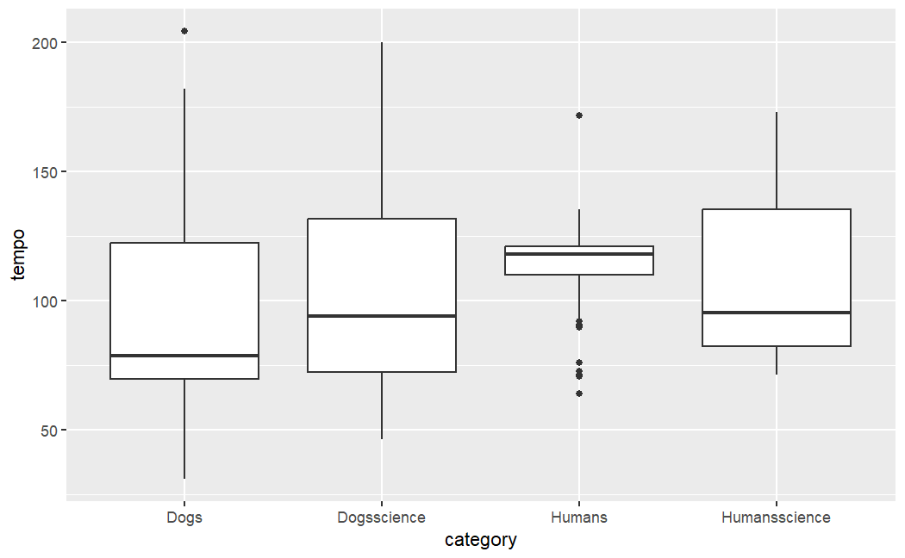
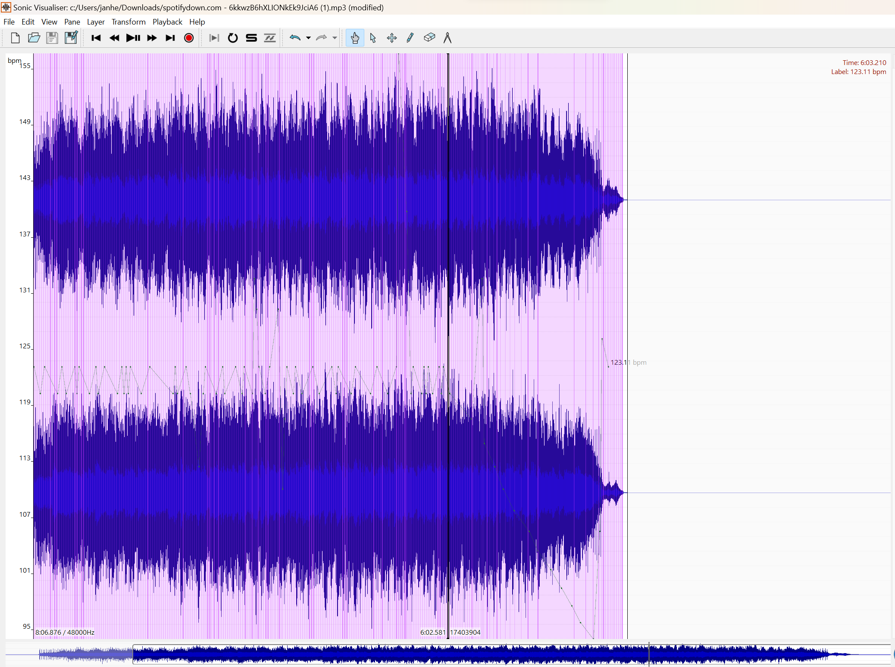

<style type="text/css">
  body{
  font-size: 12pt;
}
</style>


```{r, setup}

library(tidyverse)
library(plotly)
library(spotifyr)
library(compmus)
library(grid)
library(knitr)
library(gridExtra)
library(heatmaply)
library(ggdendro)
library(recipes)
```

```{r,}
circshift <- function(v, n) {
  if (n == 0) v else c(tail(v, n), head(v, -n))
}

#      C     C#    D     Eb    E     F     F#    G     Ab    A     Bb    B
major_chord <-
  c(   1,    0,    0,    0,    1,    0,    0,    1,    0,    0,    0,    0)
minor_chord <-
  c(   1,    0,    0,    1,    0,    0,    0,    1,    0,    0,    0,    0)
seventh_chord <-
  c(   1,    0,    0,    0,    1,    0,    0,    1,    0,    0,    1,    0)

major_key <-
  c(6.35, 2.23, 3.48, 2.33, 4.38, 4.09, 2.52, 5.19, 2.39, 3.66, 2.29, 2.88)
minor_key <-
  c(6.33, 2.68, 3.52, 5.38, 2.60, 3.53, 2.54, 4.75, 3.98, 2.69, 3.34, 3.17)

chord_templates <-
  tribble(
    ~name, ~template,
    "Gb:7", circshift(seventh_chord, 6),
    "Gb:maj", circshift(major_chord, 6),
    "Bb:min", circshift(minor_chord, 10),
    "Db:maj", circshift(major_chord, 1),
    "F:min", circshift(minor_chord, 5),
    "Ab:7", circshift(seventh_chord, 8),
    "Ab:maj", circshift(major_chord, 8),
    "C:min", circshift(minor_chord, 0),
    "Eb:7", circshift(seventh_chord, 3),
    "Eb:maj", circshift(major_chord, 3),
    "G:min", circshift(minor_chord, 7),
    "Bb:7", circshift(seventh_chord, 10),
    "Bb:maj", circshift(major_chord, 10),
    "D:min", circshift(minor_chord, 2),
    "F:7", circshift(seventh_chord, 5),
    "F:maj", circshift(major_chord, 5),
    "A:min", circshift(minor_chord, 9),
    "C:7", circshift(seventh_chord, 0),
    "C:maj", circshift(major_chord, 0),
    "E:min", circshift(minor_chord, 4),
    "G:7", circshift(seventh_chord, 7),
    "G:maj", circshift(major_chord, 7),
    "B:min", circshift(minor_chord, 11),
    "D:7", circshift(seventh_chord, 2),
    "D:maj", circshift(major_chord, 2),
    "F#:min", circshift(minor_chord, 6),
    "A:7", circshift(seventh_chord, 9),
    "A:maj", circshift(major_chord, 9),
    "C#:min", circshift(minor_chord, 1),
    "E:7", circshift(seventh_chord, 4),
    "E:maj", circshift(major_chord, 4),
    "G#:min", circshift(minor_chord, 8),
    "B:7", circshift(seventh_chord, 11),
    "B:maj", circshift(major_chord, 11),
    "D#:min", circshift(minor_chord, 3)
  )

key_templates <-
  tribble(
    ~name, ~template,
    "Gb:maj", circshift(major_key, 6),
    "Bb:min", circshift(minor_key, 10),
    "Db:maj", circshift(major_key, 1),
    "F:min", circshift(minor_key, 5),
    "Ab:maj", circshift(major_key, 8),
    "C:min", circshift(minor_key, 0),
    "Eb:maj", circshift(major_key, 3),
    "G:min", circshift(minor_key, 7),
    "Bb:maj", circshift(major_key, 10),
    "D:min", circshift(minor_key, 2),
    "F:maj", circshift(major_key, 5),
    "A:min", circshift(minor_key, 9),
    "C:maj", circshift(major_key, 0),
    "E:min", circshift(minor_key, 4),
    "G:maj", circshift(major_key, 7),
    "B:min", circshift(minor_key, 11),
    "D:maj", circshift(major_key, 2),
    "F#:min", circshift(minor_key, 6),
    "A:maj", circshift(major_key, 9),
    "C#:min", circshift(minor_key, 1),
    "E:maj", circshift(major_key, 4),
    "G#:min", circshift(minor_key, 8),
    "B:maj", circshift(major_key, 11),
    "D#:min", circshift(minor_key, 3)
  )
```

```{r, selecting data from spotify and combining for analysis}

dogs <- get_playlist_audio_features("", "5hQo2asoxqQrnJFeufycj1")
humans <- get_playlist_audio_features("", "3B0FtfxNiFOo82o8lmJcIp")
dogsscience <- get_playlist_audio_features("", "0km3mDUsP3LYDS1BZfqsY5")
humansscience <- get_playlist_audio_features("", "1t06IDDtn5eYo4Ow7Fwmcb")
smmdogscience <- get_tidy_audio_analysis("7HbGp6rllsPR9a9Gud2N9y")
outlierdanceabilityhumans <- get_tidy_audio_analysis("2IawV9XXCRxf27TjmrbIZs")
wecanfly <- get_tidy_audio_analysis("0ziUt5zRNQLNmb9LTV7CoY")

combine4lists <-
bind_rows(
humans |> mutate(category = "Humans"),
dogs |> mutate(category = "Dogs"),
dogsscience |> mutate(category = "Dogsscience"),
humansscience |> mutate(category = "Humansscience")
)
```
```{r, cepstrogram for Weightless Union}

singlehumanscience <-
  get_tidy_audio_analysis("6kkwzB6hXLIONkEk9JciA6") |> # Change URI.
  compmus_align(bars, segments) |>                     # Change `bars`
  select(bars) |>                                      #   in all three
  unnest(bars) |>                                      #   of these lines.
  mutate(
    pitches =
      map(segments,
        compmus_summarise, pitches,
        method = "rms", norm = "euclidean"              # Change summary & norm.
      )
  ) |>
  mutate(
    timbre =
      map(segments,
        compmus_summarise, timbre,
        method = "rms", norm = "euclidean"              # Change summary & norm.
      )
  )
```
```{r, cepstrograms on Totally Beached  first attempts this one for dogs}

singledogsscience <-
  get_tidy_audio_analysis("0SLtSDSjPupBUmrXtUNgPE") |> # Change URI.
  compmus_align(bars, segments) |>                     # Change `bars`
  select(bars) |>                                      #   in all three
  unnest(bars) |>                                      #   of these lines.
  mutate(
    pitches =
      map(segments,
        compmus_summarise, pitches,
        method = "rms", norm = "euclidean"              # Change summary & norm.
      )
  ) |>
  mutate(
    timbre =
      map(segments,
        compmus_summarise, timbre,
        method = "rms", norm = "euclidean"              # Change summary & norm.
      )
  )
```

### Computational-Musicology - "It's a dogs life" {data-commentary-width="650"}

This website describes my project for the course Computational Musicology in the third year of doing a Bachelors study Musicology at the University of Amsterdam (with a specialization in Music Cognition). The course deals with the use of computers as a tool for answering musicological questions.

My project has initially aimed to search for music playlists on Spotify with keywords 'relax', 'relaxation' or 'calming'. Not only for humans but also -and specifically- for dogs. There is a large quantity of music (artists, albums, playlists) available on Spotify with those keywords, also for dogs (and cats, jointly our most favorite pets to live with us, human beings).

I attempted to -first broadly- search, then self-assemble and -select, qualify, compare, and (deeply) analyze music (playlists and individual songs) on Spotify, specifically searching for **similarities** and/or **differences** in 'calming/relaxing music' for humans and for dogs.

The interest stems from my scientific curiosity into the emotional and behavioral effects of sounds (specifically **musical** sounds in this project) for humans and animals (dogs here!) alike. Not least because of my love for my own pet dog, Tess, a 3-year-old Toller Retriever (see photo right here where she is alert and active -which is great- but she needs her relax moments very much too!). Her well-being means the world to me and if we can understand the potential calming effects of sounds to dogs a bit better, I hope this can assist in furthering the broad animal's well-being policies and guidelines.

In the next tabs to the right, graphs and texts will provide some insights into the various aspects of music that I dived into for this project. I hope you'll find it interesting to read!

------------------------------------------------------------------------

{width="14cm"}

------------------------------------------------------------------------


### Introduction to the analysis of music for this project, selected on Spotify with keywords 'relax(ation)'/ 'calming'; four playlists defined {data-commentary-width="350"}

**For this project I have analysed playlists on Spotify with keywords 'calming' or '(relax)ing' or 'relaxation'. I qualified, selected & grouped them (eventually after looking at some scientific research, see below) fourfold as follows:**

1.  general relaxation playlist for humans ("Humans")
2.  general relaxation playlist for dogs ("Dogs")
3.  specific relaxation playlist for humans, based upon (some) scientific research ("Humansscience")
4.  specific relaxation playlist for dogs, based upon (some) scientific research ("Dogsscience")

All 4 are own-made playlists/groups.

The **overall corpus** is made from songs from many playlists on Spotify that exist for those keywords. It is my working hypothesis that the first two playlists are hardly different and that a high level of anthropomorphism is applicable =\> we assume that what humans define and perceive as relaxing music will be true for dogs also and -hence- playlist 2 is based (assumption!) on similar criteria/elements as for playlist 1.

Multiple research from various disciplines (neurosciences, psychology, biology, animal studies, some in cooperation with musicologists) has been done into calming/relaxing effects of music, both for humans as for dogs. For the first and third group, humans, we know much more given a broader spectrum of feedback: we have language as feedback system whereas with dogs we are limited to observing their behavior and measuring bodily aspects like blood pressure, heartrate or hormone levels (like cortisol, the 'stress hormone').

With music for dogs, research shows that similar musical aspects towards calming apply as for humans (energy, loudness, pitch, instruments) but also some differences (like on 'nature' sounds: dogs dislike thunder sounds whereas humans can interpret thunder as part of the spectrum of sounds of nature and find it relaxing: see [this article](https://www.rte.ie/lifestyle/living/2019/0213/1029317-thunder-therapy-the-sleep-aid-taking-the-world-by-storm/#:~:text=A%202016%20study%20carried%20out,fight%2Dor%2Dflight%20instinct.). 
On the aspect of **variety** in sounds for dogs I refer specifically to [Bowman, 2017](https://www.sciencedirect.com/science/article/abs/pii/S0031938416306977) wherein is stated that "..the effect of habituation may be reduced by increasing the variety of auditory enrichment provided." (end of Abstract). In simple words: dogs get habituated (i.e. bored) when there's little variety in music styles/genres and the calming effect of music dilutes.

Groups 3 and 4, defined on **certain** (bear in mind: I limited myself to just a few studies, see below) scientific research, may show (significant) differences with groups 1 and 2 on a variety of musical 'elements'. Also between groups 3 and 4, I wanted to analyze similarities and -especially- search for differences.

All but 1 (nr. 3) playlists are large, i.e. \> 200 songs each. Nr. 3 only contains 10 songs.

('Elements" are aspects of music that Spotify allows for analysis as described [on Spotify](https://developer.spotify.com/documentation/web-api/reference/#/operations/get-audio-features%3E)) e.g. loudness, tempo or mode (major or minor)

It might also be that 'true' calming music for dogs is based on musical elements that disqualify for humans as true music (i.e. pitches in sounds at frequency levels unhearable for humans but hearable for dogs. This is not in scope for this project, one reason being is that Spotify doesn't contain (high-pitched) sounds that are non-perceivable for humans but that dogs CAN hear.

My 3d group is based upon **this** research into the most relaxing (i.e. anxiety reducing) songs for humans: [neuroscience on anxiety reduction](https://www.inc.com/melanie-curtin/neuroscience-says-listening-to-this-one-song-reduces-anxiety-by-up-to-65-percent.html) with [official playlist](https://open.spotify.com/playlist/71mRGOhRHXZRSbQzouuFw7?si=7879ee525f3d4980). 
I quote from this article "...participants listened to different songs while researchers measured brain activity as well as physiological states that included heart rate, blood pressure, and rate of breathing." The song elected as nr 1 in a top 10 of most relaxing songs is **"Weightless"** by **Marconi Union** (a song which will be deeply analysed in the next tabs). I further quote: "Equally remarkable is the fact the song was actually constructed to do so. The group that created"Weightless", Marconi Union, did so in collaboration with sound therapists. Its carefully arranged harmonies, rhythms, and bass lines help slow a listener's heart rate, reduce blood pressure and lower levels of the stress hormone cortisol." The group I created for this research is an exact copy of this top 10.

I based my fourth group, called on Spotify "Through a Dogs Ear, science-based supposedly" upon the following paper and the available public playlists in Spotify labeled (published by authors of this research). See ["Through a Dogs Ear"](https://icalmpet.com/wp-content/uploads/BioAcoustic-Research-and-Development-Executive-Summary.pdf). Also have a look at [a review of Leeds work](https://www.coldnosecompanions.com/wp-content/uploads/2020/01/Through-a-Dogs-Ear-Review.pdf). The emphasis of this research is very much on a concept called **psycho- and bioacoustics**. I quote: "Psychoacoustics is the discipline that studies the perception of sound in humans. This includes how we listen, our psychological responses, and the physiological impact of music and sound on the human nervous system. Bioacoustics is the study of sound in animals. It looks at how animals communicate, as well as the positive and negative effects of sound in their environments." However, the claims by the authors of "Through a Dogs Ear" are refuted in a recent summary article from 2020, ["Musical Dog"](https://www.ncbi.nlm.nih.gov/pmc/articles/PMC7022433/) regarding the use of music towards dogs behaviour and well-being, stating (in Abstract): "Overall, exposure to classical music appears to have a calming influence on dogs in stressful environments, with no additional benefit observed from any music purposely designed for dogs (specifically"Through a dog's ear")."

(For those really interested: [Animals](https://www.mdpi.com/journal/animals) is a well-known scientific magazine focused entirely on animals.

**My expectations/assumptions about similarities and/or differences between these 4 groups in regards to the most important musical elements were roughly as follows:**

-   on Loudness, Energy and Danceability I expected all 4 groups to score low
-   on Tempo I expected all groups to be largely in the 60-80 BPM range (as research shows that a musical beat that is close to our (and dogs) heartrate is assistful to relaxation)
-   on other elements like e.g. speechiness, instrumentalness or acousticness I didn't formulate specific expectations beforehand (but was rather surprised with some differences between playlists, see next tab)
-   for the playlist 4 (dogs, science-based) I expected the aspect of 'bioacoustics' to be largely represented in the combined Spotify elements tempo, loudness, danceability and energy; it's near-impossible to weigh the importance of each of these aspects although tempo seems to me a crucial element. Also I was curious to delve into timbre aspects of the dogs science-based playlist to see if there are some common characteristics.

------------------------------------------------------------------------

**The playlists used in Spotify:**

Spotify playlist humans:

<iframe style="border-radius:12px" src="https://open.spotify.com/embed/playlist/3B0FtfxNiFOo82o8lmJcIp?utm_source=generator" width="100%" height="352" frameBorder="0" allowfullscreen allow="autoplay; clipboard-write; encrypted-media; fullscreen; picture-in-picture" loading="lazy"></iframe>

<https://open.spotify.com/playlist/3B0FtfxNiFOo82o8lmJcIp?si=d6447cd190234b6a>

Spotify playlist dogs:

<iframe style="border-radius:12px" src="https://open.spotify.com/embed/playlist/5hQo2asoxqQrnJFeufycj1?utm_source=generator" width="100%" height="352" frameBorder="0" allowfullscreen allow="autoplay; clipboard-write; encrypted-media; fullscreen; picture-in-picture" loading="lazy">

<https://open.spotify.com/playlist/5hQo2asoxqQrnJFeufycj1?si=565ef05c6ff24ae0>

Spotify playlist humans scientific:

<iframe style="border-radius:12px" src="https://open.spotify.com/embed/playlist/1t06IDDtn5eYo4Ow7Fwmcb?utm_source=generator" width="100%" height="352" frameBorder="0" allowfullscreen allow="autoplay; clipboard-write; encrypted-media; fullscreen; picture-in-picture" loading="lazy">

</iframe>


<https://open.spotify.com/playlist/1t06IDDtn5eYo4Ow7Fwmcb?si=5d4a68e5d2334b34>

Spotify playlist dogs scientific:

<iframe style="border-radius:12px" src="https://open.spotify.com/embed/playlist/0km3mDUsP3LYDS1BZfqsY5?utm_source=generator" width="100%" height="352" frameBorder="0" allowfullscreen allow="autoplay; clipboard-write; encrypted-media; fullscreen; picture-in-picture" loading="lazy">

</iframe>


<https://open.spotify.com/playlist/0km3mDUsP3LYDS1BZfqsY5?si=2775cd3b8a18422d)>

------------------------------------------------------------------------

### A first analysis of some single musical elements across the 4 playlists {data-commentary-width="550"}

```{r}
akoestiek <- combine4lists |>
   ggplot(aes(x = category, y = acousticness)) +
  
  geom_boxplot()

instrumentaliteit <- combine4lists |>
  ggplot(aes(x = instrumentalness)) +
  geom_histogram(binwidth = 0.1) +
  facet_wrap(~category)

valentie <- combine4lists |>
  ggplot(aes(x = category, y = valence)) +
  geom_violin()

modus <- combine4lists |>
  ggplot(aes(x = mode)) +
  geom_histogram(binwidth = 0.1) +
  facet_wrap(~category)

grid.arrange(akoestiek, instrumentaliteit, valentie, modus, ncol = 2)
```

------------------------------------------------------------------------

I started my analysis of the playlists with a comparison on some single elements between the 4 groups. To the left here I present 4 graphs on individual variables in the playlists and I focus on some musical elements for which I had **no** 'hard' or explicit expectations on what the outcomes would be: on acousticness, instrumentalness, valence and mode. Bear in mind that the playlist "humansscience" only contains 10 songs, hence the low bars in the histograms.

First, acousticness: a surprising difference between the 2 dogs playlists and -especially- the playlist humans. Much higher values for the 2 dogs lists. When randomly listening to songs from all lists I can understand this difference: on the humans list there are many more EDM-style/derived songs, e.g. have a listen to [Ferrari, Gill Bates](https://open.spotify.com/track/7bYb2YiGly9BaYtMBzY7T6?si=72a2a188dbf640c5) which has a feel of directly coming from a DAW (**digital** audio workstation).

This score is....complicated by the second chart (histogram) on instrumentalness, where the 2 dogs lists score very high and the general human list. So, the 2 dogs lists are high on acousticness **AND** low vocal content whereas the low-acoustic songs from playlist humans score **HIGH** on vocals.

What I find really intriguing are the 2 charts below (valence and mode): both dogs playlists score higher on major mode than minor (regular dogs significantly) BUT....this does NOT correlate with a higher valence figures for these playlists. Whereas normally the major mode is associated with positive valence.

(why histogram for mode: mode is a discrete value (0 or 1 and nothing in between) and that's why a histogram is the better way of displaying. The adjacent violin plot on valence has relative low values for dogs and somewhat higher for humans general)

Regarding tempo : normally the higher tempo, the happier the music is perceived (valence), the slower tempo the music has, the sadder the perception is.

So, I believe that tempo plays the disturbing role here of 'party pooper' on the 'normal' correlation between (major) mode and (high) valence. The dogs playlists dominate for major mode but with a low valence factor which is caused by a predominant low tempo in these playlists (see also the Tab on Tempograms). 

------------------------------------------------------------------------

### Combined analysis of 4 key musical elements, observed over the 4 playlists {data-commentary-width="550"}

```{r, 4 categories compared}

combine4lists <-
  humans |>
  mutate(playlist_name = "Relaxation music humans") |>
  bind_rows(dogs |> mutate(playlist_name = "Relaxation music dogs")) |>
  bind_rows(humansscience |> mutate(playlist_name = "Relaxation humans, science-based")) |>
  bind_rows(dogsscience |> mutate(playlist_name = "Relaxation dogs, science-based")) |>
  mutate(
    playlist_name = fct_relevel(playlist_name, "Relaxation music humans", "Relaxation music dogs", "Relaxation humans, science-based", "Relaxation dogs, science-based")
  )

 setup  <-
  combine4lists |>
  ggplot(                          # Set up the plot.
    aes(
      x = tempo,
      y = energy,
      size = danceability,
      colour = loudness,
      label = track.name           # Labels will be interactively visible.
    )
  ) +
  geom_point() +                   # Scatter plot.
  geom_rug(size = 0.1) +           # Add 'fringes' to show data distribution.
  facet_wrap(~playlist_name, scales = "free") +           # Separate charts per country.
  scale_x_continuous(              # Fine-tune the x axis.
    limits = c(0, 200),
    breaks = c(0, 100, 200),        # Use grid-lines for quadrants only.
                # Remove 'minor' grid-lines.
  ) +
  #scale_y_continuous(              # Fine-tune the y axis in the same way.
  #  limits = c(0, 1),
 #   breaks = c(0, 0.50, 1),
    
 # ) +
  scale_colour_viridis_c(          # Use the cividis palette
    option = "E",                  # Qualitative set.
    alpha = 0.8,                   # Include some transparency
    guide = "none"
  ) +
  scale_size_continuous(           # Fine-tune the sizes of each point.
    guide = "none"                 # Remove the legend for size.
  ) +
  theme_light() +                  # Use a simpler theme.
  labs(                            # Make the titles nice.
    x = "Tempo",
    y = "Energy"
  )

ggplotly(setup)
```

------------------------------------------------------------------------

Comparing the 4 playlists on **key musical elements** tempo (x) , energy (y), loudness (color) and danceability (size) as can be seen in the chart left, brings up some interesting and unexpected differences. As mentioned earlier (see Tab "Introduction..."), I expected a lot of similarity across the playlists on these 4 variables (omitting speechiness here as variable). Much to my surprise, there are much bigger differences than I presumed.

Both dogs playlists score significantly lower on energy than the 2 human playlists. Bear in mind when comparing these graphs that the y axis (for energy) has a different scales for each playlist which means that the differences between humans and dogs are even more dramatic!

The same applies for loudness, where the human playlists score high (yellow) and the dogs playlists much lower (blue).

Tempo for humans centers around 120 BPM whereas for dogs it much more in the 60-80 BPM range.

On danceability also a difference can be seen (on average the dogs playlists have many more smaller cells) but not as big as with the other 3 variables.

What mostly struck me is the wide spread of the songs in playlist 3 humans science-based, across these 4 variables. As these 10 songs - supposedly- form a top 10 of most relaxing song for humans (specifically: to relief anxiety and stress e.g. pre-surgery) why do they not score similarly or at least near to the nr 1. (i.e. most relaxing) song on that list: [Weightless by Marconi Union](https://open.spotify.com/track/6kkwzB6hXLIONkEk9JciA6?si=d4a832d2eef54ec5)? I selected this as the 'archetype' song for this playlist.

With playlist nr. 4, there appears at first sight a -seemingly large- difference on energy (y-axis) level with the other dogs playlist **BUT** the y-axes are differently scaled so on closer look they are comparable on energy level. 
For this playlist 4 I chose the song [Totally Beached by Joshua Leeds](https://open.spotify.com/track/0SLtSDSjPupBUmrXtUNgPE?si=bb2db41ce65d445d) as 'archetype' song for this playlist. Partly I chose this because the song has a reggae style 'vibe' to it and this [research](http://eprints.gla.ac.uk/135846/) has identified reggae as a preferred genre by dogs (from a relaxation perspective).

------------------------------------------------------------------------

### Analysis of 2 **'archetype'** songs in terms of chroma features (providing pitch class insights) as can be seen in chromagrams {data-commentary-width="500"}

```{r, selection of several songs for bla chroma analysis}

chromadog <- get_tidy_audio_analysis("0SLtSDSjPupBUmrXtUNgPE") |>
  select(segments) |>
  unnest(segments) |>
  select(start, duration, pitches)

chromahuman <- get_tidy_audio_analysis("6kkwzB6hXLIONkEk9JciA6") |>
   select(segments) |>
  unnest(segments) |>
  select(start, duration, pitches)
```

```{r, chroma bla for humans and dogs libeuclidian}
chromahumanweightless <- chromahuman |>
  mutate(pitches = map(pitches, compmus_normalise, "chebyshev")) |>
  compmus_gather_chroma() |> 
  ggplot(
    aes(
      x = start + duration / 2,
      width = duration,
      y = pitch_class,
      fill = value
    )
  ) +
  geom_tile() +
  labs(x = "Time (s)", y = NULL, fill = "Magnitude", title = "Weightless (Marconi Union)") +
  theme_minimal() +
  scale_fill_viridis_c()

chromadogstotallybeached <- chromadog |>
  mutate(pitches = map(pitches, compmus_normalise, "chebyshev")) |>
  compmus_gather_chroma() |> 
  ggplot(
    aes(
      x = start + duration / 2,
      width = duration,
      y = pitch_class,
      fill = value
    )
  ) +
  geom_tile() +
  labs(x = "Time (s)", y = NULL, fill = "Magnitude", title = "Totally beached (Joshua Leeds)") +
  theme_minimal() +
  scale_fill_viridis_c()
grid.arrange(chromahumanweightless, chromadogstotallybeached, ncol = 1)
```

------------------------------------------------------------------------

**Following earlier analysis I proceeded with a few selected songs from the 2 science-based playlists to deeper analyse other aspects as provided by chromagrams**

This tab explains the pitch-classes structure of the song "Weightless" from playlist 3, humans science as well from the song "Totally Beached", an archetypical song in the playlist 4, dogs science-based.

**WEIGHTLESS**

I selected the song "Weightless" by Marconi Union from group 3 (humans, science-based) upon [this research](https://www.britishacademyofsoundtherapy.com/wp-content/uploads/2019/10/Mindlab-Report-Weightless-Radox-Spa.pdf) into relaxing capabilities of music to lower anxiety in humans (e.g. pre-surgery). This study concluded upon a top 10 list of most relaxing songs, with Weightless as nr 1.

Weightless is -intendedly- not a very energetic or (pitch/chords/timbre) changing song, quite the opposite. When listening to it, I can hear the change to emphasis on D and A happening after exactly 89 seconds. At the 'expense' of the minor terts in D, the F, although light green for F can be seen for most of the remainder of the track. Some, but only very little, melodic aspects come into play after 89 sec. Reason for this is, as explained by the researchers in their study, that -when trying to have humans relax to music- they want to minimize the brain activity related to predicting where the melody is developing to.

<iframe style="border-radius:12px" src="https://open.spotify.com/embed/track/6kkwzB6hXLIONkEk9JciA6?utm_source=generator" width="100%" height="85" frameBorder="0" allowtransparency="true" allow="encrypted-media" data-external="1">

allowfullscreen="" allow="autoplay; clipboard-write; encrypted-media; fullscreen; picture-in-picture" loading="lazy"\>

</iframe>


**TOTALLY BEACHED**

I selected the song "Totally beached" from the fourth group (dogs, science-based) for a further analysis because it has a strong reggae 'vibe' to it and [certain research](https://www.scottishspca.org/news/reggae-gets-paw-of-approval) on the effect of music on calming dogs found that reggae music (together with soft rock and classic) is a genre preferred by dogs.

Totally Beached is a relative short song, where in the chromagram I believe to see a clear reggae-style appearance of offbeat chord elements. The song follows a classic reggae chord development between I and IV (in this case G minor and C minor). What surprises me in the chrogram is a relative small prominence of Eb, the terts in C minor. The last 10 seconds are a fading-out stall of the applied instruments, hanging on to a single C-dominated finale.

<iframe style="border-radius:12px" src="https://open.spotify.com/embed/track/0SLtSDSjPupBUmrXtUNgPE?utm_source=generator" allowfullscreen width="100%" height="85" frameBorder="0" allowtransparency="true" allow="encrypted-media" data-external="1" allow="autoplay; clipboard-write; encrypted-media; fullscreen; picture-in-picture" loading="lazy">

</iframe>

------------------------------------------------------------------------

### Some timbre analysis with the help of cepstrograms {data-commentary-width="450"}

```{r, cepstrogram for bla Weightless Union}

singlehumanscience <-
  get_tidy_audio_analysis("6kkwzB6hXLIONkEk9JciA6") |> # Change URI.
  compmus_align(bars, segments) |>                     # Change `bars`
  select(bars) |>                                      #   in all three
  unnest(bars) |>                                      #   of these lines.
  mutate(
    pitches =
      map(segments,
        compmus_summarise, pitches,
        method = "rms", norm = "euclidean"              # Change summary & norm.
      )
  ) |>
  mutate(
    timbre =
      map(segments,
        compmus_summarise, timbre,
        method = "rms", norm = "euclidean"              # Change summary & norm.
      )
  )
```

```{r, cepstrograms on bla Totally Beached  first attempts this one for dogs}

singledogsscience <-
  get_tidy_audio_analysis("0SLtSDSjPupBUmrXtUNgPE") |> # Change URI.
  compmus_align(bars, segments) |>                     # Change `bars`
  select(bars) |>                                      #   in all three
  unnest(bars) |>                                      #   of these lines.
  mutate(
    pitches =
      map(segments,
        compmus_summarise, pitches,
        method = "rms", norm = "euclidean"              # Change summary & norm.
      )
  ) |>
  mutate(
    timbre =
      map(segments,
        compmus_summarise, timbre,
        method = "rms", norm = "euclidean"              # Change summary & norm.
      )
  )
```

```{r, cepstrogram on weightless and totally beached combined}
cepstrh <- singlehumanscience|>
  compmus_gather_timbre() |>
  ggplot(
    aes(
      x = start + duration / 2,
      width = duration,
      y = basis,
      fill = value
    )
  ) +
  geom_tile() +
  labs(x = "Time (s)", title = "Weightless (Marconi Union)", y = NULL, fill = "Magnitude") +
  scale_fill_viridis_c() +                              
  theme_classic()

cepstrod <- singledogsscience|>
  compmus_gather_timbre() |>
  ggplot(
    aes(
      x = start + duration / 2,
      width = duration,
      y = basis,
      fill = value
    )
  ) +
  geom_tile() +
  labs(x = "Time (s)", title = "Totally beached (Joshua Leeds)", y = NULL, fill = "Magnitude") +
  scale_fill_viridis_c() +                              
  theme_classic()
grid.arrange(cepstrh, cepstrod, ncol = 1)
```

------------------------------------------------------------------------

On the left here are 2 cepstrograms, aimed at providing insights into the different timbre aspects of pieces of music.

The cepstrogram on **'Weightless'**, the song elected as most relaxing for humans, shows an enormous amount of yellow c02 timbre elements, meaning a high level of brightness 'at the expense' of other timbre aspects. The first 16 seconds/beats of the song a spread (in green) between C2 and C03 occurs and this relates to the fade-in of the synths elements that reach peak from that moment and -thus- further concentrates in C02. 4.52 minutes into the song another high-pitched element is introduced and from that moment on some more "C02-interrupting" musical elements (mostly high-pitched sounds) are put into the mix of the audio. This can be seen in the occasional interruption of bright yellow in C02 after 500 seconds in conjunction with green in other timbre aspects. From that moment on the spectrum of timbre incidentally 'dilutes' away from brightness into a broader spectrum of timbre elements.

For the second cepstrogram: first indications make me think that flatness (Co3) is indeed high in **'Totally Beached'**. Also a relative high level of C04 which relates to the relative sharp 'attack' style of the strumming guitar with reggae. Between seconds 85 and 95 bass guitar and percussion are gone (less C03), then bass guitar comes back (more C02) and then percussion also comes back from second 116 and everything is back to 'normal'. The 2 dark yellow marks for Co3 at 130 seconds and 143 seconds relate to a short cymbal sound at these moments.

Both songs, especially Weightless, score relatively low on C01 (which correlates to loudness) in these cepstrograms and this is in line with the individual loudness variable measurements by the Spotify API (-19.974 for Weightless and -18.861 for Totally Beached).

------------------------------------------------------------------------

### A few Self-Similarity Matrices on selected songs {data-commentary-width="500"}


```{r for SSM dogsscience, {r, fig.width=15, fig.height=12, echo=FALSE, message=FALSE}

smmdogscience <-
  get_tidy_audio_analysis("7HbGp6rllsPR9a9Gud2N9y") |>
  compmus_align(bars, segments) |>
  select(bars) |>
  unnest(bars) |>
  mutate(
    pitches =
      map(segments,
        compmus_summarise, pitches,
        method = "acentre", norm = "manhattan"
      )
  ) |>
  mutate(
    timbre =
      map(segments,
        compmus_summarise, timbre,
        method = "mean"
      )
  )
smmdogscience <- bind_rows(
  smmdogscience |>
    compmus_self_similarity(pitches, "aitchison") |>
    mutate(d = d / max(d), type = "Chroma"),
  smmdogscience |>
    compmus_self_similarity(timbre, "euclidean") |>
    mutate(d = d / max(d), type = "Timbre")
) |>
  mutate() |>
  ggplot(
    aes(
      x = xstart + xduration / 2,
      width = xduration,
      y = ystart + yduration / 2,
      height = yduration,
      fill = d
    )
  ) +
  geom_tile() +
  coord_fixed() +
  facet_wrap(~type) +
  scale_fill_viridis_c(guide = "none") +
  theme_classic() +
  labs(x = "", title = "Canine Relaxation - Pet Care Club", y = "")


outlierdanceabilityhumans <-
  get_tidy_audio_analysis("2IawV9XXCRxf27TjmrbIZs") |>
  compmus_align(bars, segments) |>
  select(bars) |>
  unnest(bars) |>
  mutate(
    pitches =
      map(segments,
        compmus_summarise, pitches,
        method = "acentre", norm = "manhattan"
      )
  ) |>
  mutate(
    timbre =
      map(segments,
        compmus_summarise, timbre,
        method = "mean"
      )
  )
outlierdanceabilityhumans <- bind_rows(
  outlierdanceabilityhumans |>
    compmus_self_similarity(pitches, "aitchison") |>
    mutate(d = d / max(d), type = "Chroma"),
  outlierdanceabilityhumans |>
    compmus_self_similarity(timbre, "euclidean") |>
    mutate(d = d / max(d), type = "Timbre")
) |>
  mutate() |>
  ggplot(
    aes(
      x = xstart + xduration / 2,
      width = xduration,
      y = ystart + yduration / 2,
      height = yduration,
      fill = d
    )
  ) +
  geom_tile() +
  coord_fixed() +
  facet_wrap(~type) +
  scale_fill_viridis_c(guide = "none") +
  theme_classic() +
  labs(x = "", title = "Disturbia - Lenji", y = "")


grid.arrange(outlierdanceabilityhumans, smmdogscience, ncol = 1)
```


------------------------------------------------------------------------

For this section I deviated from the 2 'archetype' songs that I analysed in the pervious tabs, reason being they didn't produce very interesting self-similarity matrices and I wanted to analyse something else.

From playlist 1 (humans general): Disturbia - Lenji


<iframe src="https://open.spotify.com/embed/playlist/track/2IawV9XXCRxf27TjmrbIZs?utm_source=generator" width="100%" height="85" frameBorder="0" allowtransparency="true" allow="encrypted-media" data-external="1"></iframe>


This song is an outlier on danceability is this list. It's a classic popsong (key: Am) with a 7/8 seconds intro and then the first verse. From 34-39 seconds the verse changes (short modulation to E, the fifth) and build up to a 'drop', resulting in the first chorus (back to Am). This can nicely be seen in the chromagram. The song also nicely alternates between moments of voice and bass/percussion alone vs. voice+more instruments which can be seen in the timbregram. At 100 seconds into the song, the verse doesn't immediately switch to the next chorus but a bridge of appr 15 seconds (both in chroma as in timbre to be seen) build to a climax into the second chorus around 115 seconds. 

From playlist 4 (dogsscience): Canine Relaxation - Pet Care Club


<iframe src="https://open.spotify.com/embed/playlist/track/7HbGp6rllsPR9a9Gud2N9y?utm_source=generator" width="100%" height="85" frameBorder="0" allowtransparency="true" allow="encrypted-media" data-external="1"></iframe>


A slow-paced song, ambient, no percussion, focus on chords and simple melody. The 4 checkerboards in the lower left corner of the chroma (until around 188 seconds) exemplify a double-repeated/same sized (time) piece of the song. An introduction of a high-pitched flute at 294 seconds into the song gives the dark blue small box in the chromagram. The flute stands out really for about 20 seconds, but continues and is mixed with other musical elements, hence the ending of the dark blue box. The last -some- 50 seconds of the song is no more than a slow fade-out ending with only non-changing chord elements + nature sounds, hence the dark blue box in the top right corner of the chromagram.

------------------------------------------------------------------------


### Brief keys analysis {data-commentary-width="500"}

{width="20cm", height="30cm"}


***

A simple key spread analysis over the 4 playlists. As expected by me, C, F and G stand out (for the 2 dogs lists) but not for humans, where -besides F- C# is used often together with A and B.  

***


### Chordograms {data-commentary-width="500"}

```{r, strawberryswing continued}
strawberryswing1 <- get_tidy_audio_analysis("2dphvmoLEXdk8hOYxmHlI3") |>
  compmus_align(sections, segments) |>
  select(sections) |>
  unnest(sections) |>
  mutate(
    pitches =
      map(segments,
        compmus_summarise, pitches,
        method = "mean", norm = "manhattan"
      )
  )

strawberryswing1 |> 
  compmus_match_pitch_template(
    key_templates,         # Change to chord_templates if descired
    method = "euclidean",  # Try different distance metrics
    norm = "manhattan"     # Try different norms
  ) |>
  ggplot(
    aes(x = start + duration / 2, width = duration, y = name, fill = d)
  ) +
  geom_tile() +
  scale_fill_viridis_c(guide = "none") +
  theme_minimal() +
  labs(x = "Time (s)", y = "")

strawberryswing2 <- get_tidy_audio_analysis("2dphvmoLEXdk8hOYxmHlI3") |>

  compmus_align(bars, segments) |>
  select(bars) |>
  unnest(bars) |>
  mutate(
    pitches =
      map(segments,
        compmus_summarise, pitches,
        method = "mean", norm = "manhattan"
      )
  ) 
strawberryswing2 |> 
  compmus_match_pitch_template(chord_templates, "euclidean", "manhattan") |>
  ggplot(
    aes(x = start + duration / 2, width = duration, y = name, fill = d)
  ) +
  geom_tile() +
  scale_fill_viridis_c(guide = "none") +
  theme_minimal() +
  labs(x = "Time (s)", y = "")
```

------------------------------------------------------------------------

As most songs from all 4 playlists are -intendedly- not very 'exciting' in terms of a lot of musical elements (and their possible changes during a song) like tempo, energy, instrumentalness, etc. I decided to pick an outlier from playlist 3 (humansscience) which scores highest on tempo and relatively high on energy: Strawberry Swing by Coldplay, to see what happens chords-wise. A key- and chordagram are presented here.

https://open.spotify.com/track/2dphvmoLEXdk8hOYxmHlI3?si=0add982162e04af4

As expected, an emphasis on I, IV and V prominence for a song in Ab. Interesting:a lot of dark blue in C# (enharmonically the same as Db). With knowledge of Western chords and their relationships (tonica, subdominant, dominant and others) I expected that the software would 'know' - in the context of this piece of music; circle of fifths!- that Db strongly 'belongs' to Ab (and C# not really).

The song is in Ab (as tonica I) with mostly changes to IV (Db) and V (Eb). This is a rather 'normal' chords progression. The black spot around 95 seconds in Db appears to me the emphasis/power on Db (as 'tension' dominant to Ab) just before 'releasing' to tonica Ab ('home'/stability). The same 'returned home' energy on Ab can been seen in the last 80 seconds of the song. As G# enharmonically is the same as Ab, it is no surprise that there's relative a lot of energy in there too. There's also a prominance to be seen in seventh chords, a usual patterns in chordagrams as explained by our lector: 'leakage' of energy in the 7th 'bin' (close to the 1st tonica) plays a role here sometimes).

------------------------------------------------------------------------

### Timbre comparison between 2 playlists (humans science and dogs science) {data-commentary-width="500"}

```{r, week 10}

humansscience <-
  get_playlist_audio_features(
    "thesoundsofspotify",
    "1t06IDDtn5eYo4Ow7Fwmcb"
  ) |>
  slice(1:30) |>
  add_audio_analysis()
dogsscience <-
  get_playlist_audio_features(
    "thesoundsofspotify",
    "0km3mDUsP3LYDS1BZfqsY5"
  ) |>
  slice(1:30) |>
  add_audio_analysis()
combine2lists <-
  humansscience |>
  mutate(genre = "Humans science") |>
  bind_rows(dogsscience |> mutate(genre = "Dogs Science"))

combine2lists |>
  mutate(
    timbre =
      map(
        segments,
        compmus_summarise,
        timbre,
        method = "mean"
      )
  ) |>
  select(genre, timbre) |>
  compmus_gather_timbre() |>
  ggplot(aes(x = basis, y = value, fill = genre)) +
  geom_violin() +
  scale_fill_viridis_d() +
  labs(x = "Spotify Timbre Coefficients", y = "", fill = "Genre")
```

### Timbre comparison between 2 playlists (dogs and dogs science) {data-commentary-width="500"}

```{r, week 10 extra}

dogs <-
  get_playlist_audio_features(
    "thesoundsofspotify",
    "5hQo2asoxqQrnJFeufycj1"
  ) |>
  slice(1:30) |>
  add_audio_analysis()
dogsscience <-
  get_playlist_audio_features(
    "thesoundsofspotify",
    "0km3mDUsP3LYDS1BZfqsY5"
  ) |>
  slice(1:30) |>
  add_audio_analysis()
combine3lists <-
  dogs |>
  mutate(genre = "Dogs") |>
  bind_rows(dogsscience |> mutate(genre = "Dogs Science"))

combine3lists |>
  mutate(
    timbre =
      map(
        segments,
        compmus_summarise,
        timbre,
        method = "mean"
      )
  ) |>
  select(genre, timbre) |>
  compmus_gather_timbre() |>
  ggplot(aes(x = basis, y = value, fill = genre)) +
  geom_violin() +
  scale_fill_viridis_d() +
  labs(x = "Spotify Timbre Coefficients", y = "", fill = "Genre")
```

***

I see no major differences in the lower (C01-c06) timbre coefficients except slightly for 04 and 06. Also perhaps  categories c06-c10 produce somewhat higher scores for Dogs Science. This graph doesn't show any real significant differences imo (whereas on acousticness, see tab "A first analysis") the dogs lists are significantly different imo. Apperently this has no influence on these timbre coefficients.


***


### Tempo analysis; a simple boxplot on tempo for my 4 playlists


{width="20cm", height="30cm"}


***

When looking at this boxplot, it strikes me that only the playlist 'dogs' has a mean around 78 BPM and the other 3 playlists are higher, even the 2 'scientific' ones. Also striking: the mean (and little SD) in the 'Humans' playlist around 120 BPM. I had expected for both science-based lists to have the tempo around 60-80 BPM (for synchronization purposes with humans and dogs rest heartrate) but no such thing; the dogsscience list even has a higher average than the regular dogs list.

When listening to the extreme outliers regarding tempo I can safely assume that the Spotify API isn't working flawlessly: e.g. the 'fastest' song from the dogsscience playlist is ["Chorale Prelude No. 5 "Ach bleib bei uns Herr Jesu Christ" in B-Flat Major, BWV 649 (Harp Version)"](<https://open.spotify.com/track/2Chgj5q0NgvBlFvzYVJvUa?si=5592371b98464c2d>) and analysed at 200 BPM by Spotify. Funny but also very inaccurate.

The same applies to the tempo outlier ["Leaves"](<https://open.spotify.com/track/60YvUB0fCvLlTDCc99wpgD?si=5f3c0edf44fd4713>) for the regular dogs playlist, clocked at 204 BPM. When listening it's apparently wrong. It's a piano-only piece of music with clearly some rubato-syle tempo changes.

***


### Tempo analysis continued; some tempograms {data-commentary-width="500"}


```{r, fig.width=15, fig.height=20, '1 single variable compared; tempo plots and gram  sjwsjs'}


singlehumanscience <- get_tidy_audio_analysis("6kkwzB6hXLIONkEk9JciA6")

tempogramsfalseforweightless <- singlehumanscience |>
  tempogram(window_size = 4, hop_size = 2, bpms = 40:160, cyclic = FALSE) |>
 ggplot(aes(x = time, y = bpm, fill = power)) +
  geom_raster() +
  scale_fill_viridis_c(guide = "none") +
  labs(x = "Time (s)", title = "Weightless - Marconi Union", y = "Tempo (BPM)") +
  theme_classic()

tempogramstrueforweightless <- singlehumanscience |>
  tempogram(window_size = 4, hop_size = 2, bpms = 40:80, cyclic = TRUE) |>
  ggplot(aes(x = time, y = bpm, fill = power)) +
  geom_raster() +
  scale_fill_viridis_c(guide = "none") +
  #scale_y_continuous(              # Fine-tune the x axis.
   # limits = c(0, 200),
    # breaks = c(0, 100, 200) +
  labs(x = "Time (s)", title = "Weightless - Marconi Union", y = "Tempo (BPM)") +
  theme_classic()
  

pureshores <- get_tidy_audio_analysis("5uHnDHx5J48FdT6FjwA7Z8")

tempogramsfalseforpureshores <- pureshores |>
  tempogram(window_size = 4, hop_size = 2, bpms = 80:240, cyclic = FALSE) |>
 ggplot(aes(x = time, y = bpm, fill = power)) +
  geom_raster() +
  scale_fill_viridis_c(guide = "none") +
  labs(x = "Time (s)", title = "Pure Shores", y = "Tempo (BPM)") +
  theme_classic()

tempogramstrueforpureshores <- pureshores |>
  tempogram(window_size = 4, hop_size = 2, bpms = 80:160, cyclic = TRUE) |>
  ggplot(aes(x = time, y = bpm, fill = power)) +
  geom_raster() +
  scale_fill_viridis_c(guide = "none") +
  #scale_y_continuous(              # Fine-tune the x axis.
   # limits = c(0, 200),
    # breaks = c(0, 100, 200) +
  labs(x = "Time (s)", title = "Pure Shores", y = "Tempo (BPM)") +
  theme_classic()
  

jorisvoornexample <- get_tidy_audio_analysis("7fqAVya5281BFkUokiXAAB")

tempogramsfalseforjoris <- jorisvoornexample |>
  tempogram(window_size = 4, hop_size = 2, cyclic = FALSE) |>
  ggplot(aes(x = time, y = bpm, fill = power)) +
  geom_raster() +
  scale_fill_viridis_c(guide = "none") +
  labs(x = "Time (s)", title = "Polydub, Joris Voorn", y = "Tempo (BPM)") +
  theme_classic()

tempogramstrueforjoris <- jorisvoornexample |>
  tempogram(window_size = 4, hop_size = 2, cyclic = TRUE) |>
  ggplot(aes(x = time, y = bpm, fill = power)) +
  geom_raster() +
  scale_fill_viridis_c(guide = "none") +
  labs(x = "Time (s)", title = "Polydub, Joris Voorn", y = "Tempo (BPM)") +
  theme_classic()
grid.arrange(tempogramsfalseforweightless, tempogramstrueforweightless, tempogramsfalseforpureshores, tempogramstrueforpureshores, tempogramsfalseforjoris, tempogramstrueforjoris, ncol = 2)

```


------------------------------------------------------------------------


Initially it was difficult to assess any tempo-related aspects of the song **Weightless** from a tempogram because the lower point of the y-axis was set at 80 BPM whereas Weightless is slower than that. Later on I found out how to set the BPM starting point lower, and set it at 40 BPM. See tempogram left here. 

In addition: I found out (from my own research, i.e. listening to the song on Spotify MANY times and clocking it) that the song Weightless is actually starting a bit slower (namely around 60 BPM) than various sources on the internet (e.g. [here](https://songbpm.com/@marconi-union/weightless)) to be starting, which is around 70 BPM. Also, very interestingly, the Spotify API gives a 71 BPM tempo! Listen yourselves, clearly incorrect!

Irrespective of this, the song is **intendedly** designed to start at a certain BPM and then -after some 5 minutes- slows down towards a lower BPM figure. Reason: assisting in bringing the heart rate of the listener down. Yet, hardly -if at all- to be seen in the tempograms: not the 60 BPM start nor the descend to around 52-54 BPM. The problem relates to the fact that the song **does** have a (low on loudness but definitely consciously hearable) 4/4 meter-type beat but the chords elements are largely ambient-like synths without clear onsets. There **are** melodical elements but they play a minor role and don't necessarily occur in a structured/repetitive manner on anyone of the 4/4 meter beats.

So, I allowed myself a sidestep towards another tool, namely Sonic Visualizer wherein (see blue-pink graph below) the waveform of Weightless is shown together with a green line that shows the result from a transform function (add-on to Sonic Profiler) for tempo and beats. The vertical black line, at 6.02 minutes into the song marks the beginning of the descent of the measured BPM's. Please note: you see here a so-called 'tempo-octave': the **green** line (please look very closely!!) averages until minute 6.02 around 122 BPM which can be interpreted as double the 'real' (at least perceived by me!) and then this green line descents.

{width="14cm"}


Just for fun (and contrast) I also had a look at an EDM song from a favorite Techno DJ of mine, Joris Voorn. The song is {Polydub](<https://open.spotify.com/track/7fqAVya5281BFkUokiXAAB?si=44ac45f5d6a94528>) from album Four: 

As can been seen very clearly: a typical 125 BPM style song. What also can be seen in the above Tempogram is the effect of 'tempo-octave' where multiple BPM doubles of 125 BPM can be seen in the graph. It is clear to me that Spotify has a much easier job in detecting a clear BPM pattern in a piece of music which is EDM-derived and has clearly articulated (and metered) percussion elements.

***


### Clustering of some characteristics in playlist 4, 'dogsscience'

```{r}
library(compmus)

get_conf_mat <- function(fit) {
  outcome <- .get_tune_outcome_names(fit)
  fit |>
    collect_predictions() |>
    conf_mat(truth = outcome, estimate = .pred_class)
}  

get_pr <- function(fit) {
  fit |>
    conf_mat_resampled() |>
    group_by(Prediction) |> mutate(precision = Freq / sum(Freq)) |>
    group_by(Truth) |> mutate(recall = Freq / sum(Freq)) |>
    ungroup() |> filter(Prediction == Truth) |>
    select(class = Prediction, precision, recall)
}
```

```{r}
clusteringdogsscience <-
  get_playlist_audio_features("bnfcollection", "0km3mDUsP3LYDS1BZfqsY5") |>
  add_audio_analysis() |>
  mutate(
    segments = map2(segments, key, compmus_c_transpose),
    pitches =
      map(segments,
        compmus_summarise, pitches,
        method = "mean", norm = "manhattan"
      ),
    timbre =
      map(
        segments,
        compmus_summarise, timbre,
        method = "mean"
      )
  ) |>
  mutate(pitches = map(pitches, compmus_normalise, "clr")) |>
  mutate_at(vars(pitches, timbre), map, bind_rows) |>
  unnest(cols = c(pitches, timbre))
```

```{r}
set.seed(40) 
rand_dogs <- clusteringdogsscience[sample(nrow(clusteringdogsscience), size=40),]
```

```{r uvvhjvefjsdjbskjdv}
clusteringdogsscience_juice <-
  recipe(
    track.name ~
      danceability +
      energy +
      loudness +
      valence +
      duration + 
      acousticness + 
      tempo,
    data = rand_dogs
  ) |>
  step_center(all_predictors()) |>
  step_scale(all_predictors()) |>
  # step_range(all_predictors()) |>
  prep(rand_dogs |> mutate(track.name = str_trunc(track.name, 30))) |>
  juice() |>
  column_to_rownames("track.name")
```

```{r}
clusteringdogs_dist <- dist(clusteringdogsscience_juice, method = "euclidean")
```

```{r, fig.width=15, fig.height=25}


heatmaply(
  clusteringdogsscience_juice,
  hclustfun = hclust,
  hclust_method = "average",  # Change for single, average, or complete linkage.
  dist_method = "euclidian"
)
```

***

I did a random selection of 40 songs from the playlist 4, dogsscience, to look at some clustering features. In the dendogram, supplemented with a 'heatmap', to the left here items that are clustered together are more similar in the ways as specified (here: look at items x-axis).

Not surprisingly: energy and loudness are clustered together. Then valence comes together with these. Danceability and tempo are added furtheron. 

The clearest outlier, by far, is the song ["Good night sweet little one"](https://open.spotify.com/track/6mXmto0YrUL5Etuw5gEQPT?si=7e78680bef2a4517): the second highest scoring on energy in the list and in a cluster of songs very low on acousticness. Explanation for this song on acousticness: only seawaves sounds. 

***


### Concluding remarks {data-commentary-width="550"}

{width="14cm"}

------------------------------------------------------------------------

Coming to this course and diving into the work of this project as a musicologist-in-spe has given me a lot of insights that strengthens my understanding of music.  Both on the individual song level as well as between playlists with multiple songs.

My primary research goal was to compare playlists and songs with 'relax(ation)' and 'calming' as keywords on similarities and differences. Furthermore, the desire was to present findings on the constituting elements of music like rhythm, pitch, timbre and volume.

**Key findings**

As the 2 dogs playlists were especially different on 2 key aspects (lower tempo and energy) from the general humans playlist, I am tempted to think that **assembly criteria** for all of the available relaxation/calming playlists on Spotify (from which I assembled assembling these lists for humans and for dogs) were **different**. 
With criteria I mean: what definition(s) of relaxation were applied to qualify suitable music? When is the music suitable for the goal of relaxation?
As the dogs playlists are relatively homogeneous on low tempo/energy, I believe that these list were assembled from a **strict** interpretation of relax(ation), i.e.: getting the dog(s) into a state of calm, dozing, (near-)sleep, lower heartrate and bloodpressure. With the general humans playlist certainly there are many songs that have characteristics to accommodate similar effects with the listeners **but**: there are also many songs (higher energy, tempo, loudness, valence) that appear **not** to be suitable for calming/getting (near-)asleep. My assessment is that 'relaxation music' for humans is a broader concept which also applies to 'quietly uplifting' the listener to a happy mood, supporting a more productive reading/studying occasion, driving in the car, watching a sunset on the beach, etc.

For the (small) science-based humans playlist (nr. 3): as this was a top 10 of songs following research into truly calming effects for humans (pre-surgery), I don't understand the composition of this list, in all honesty. The election of Weightless as nr. 1 is clear to me but the other ones are sometimes very different on tempo, energy, loudness and danceability. How can a high-danceability/energy song be lowering heart rate, blood pressure and anxiety, pre-surgery??

For Weightless, it was very nice to see the proof of intentional lowering the BPM's after 6 minutes into the song. I also had to fault Spotify's API on the assessed tempo for this song (see Tab Tempograms) which made me clearer than ever: **listen!** and also use other tooling (like Sonic Visualizer). 
The Spotify API also returned apparent incorrect outcomes on other aspects like 'speechiness', e.g. the highest scoring (0.606) on this variable in playlist 4 is [The Swan](https://open.spotify.com/track/0U5ykKn6MpH5maeCCS3CrX?si=b3631d39d381452b) where swan-sounds are interpreted as speech...

As both dogs playlists are relatively homogeneous on the 4 key musical aspects (see Tab "Combined analysis...") and certainly the science-based dogs playlist is populated with a lot of (similar sounding) piano-only songs I find it hard to say something conclusive about the importance of variation in music (see Tab Introduction, about Bowman) to avoid 'habituation'. There **is** some instrumentation variation but not a lot. 

Interestingly, 'variation' (and the resulting effect on raised attention by listener to predict/assess what's coming next in the song or the chain of songs) is actually something that the research behind playlist 3 (humansscience) claims that needs to be **avoided** in order to get humans attention too much. This research finding appear at first sight to be contradicting with the dogs research on the need for variety but...: I believe that a different timeline is applicable here. For dogs the period analysed was days whereas for human (pre-surgery) the timeline must have been a lot shorter.

Another aspect: Spotify doesn't provide music above the hearing frequency spectrum for humans (whilst dogs can hear it) so that aspect wasn't in-scope.

**Potential benefits of this project**

I can only rephrase here what I stated in the beginning: I hope to have given some insights into aspects of music that (can) contribute to **true** calming and relaxation both for humans and for dogs. 

I also believe that these kinds of analyses cater for critical assessments/claims in scientifical literature. Finally, I really feel that a project like this stands at the centre of the chasm between the MIR and music cognition community: what we truly measure and it's relevance for the 'processing' by the humans and dogs brain in terms of....perception and appreciation and bodily effects.


**Final words**
Lastly, I want to reflect on my experience with working on this project as part of the course. It was tough in the beginning to get the software working properly and get some first visualizations on Github. But with great help of the TA's and some cursing and 'sweating' I managed to get things finalized, at least to an extend that I'm happy with. Yes, I've seen much better projects from colleague-students (both look & feel as depth of analysis) but I am happy with this final state. 
It was very insightful to me to work with tools like R software in conjunction with Github and the Spotify API to 'disect' music into various small elements ( 4 key categories: duration, pitch, timbre and volume) and then assemble these in a variety of ways together to support the analysis of the questions I formulated in the beginning. By no means am I a 'beta' guy but this project got a lot of math/statistics **into me** which was good fun because.. my big passions (music and dogs!) were the keys subjects of the analysis.

------------------------------------------------------------------------
